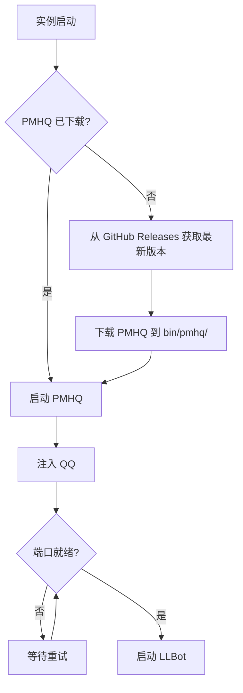
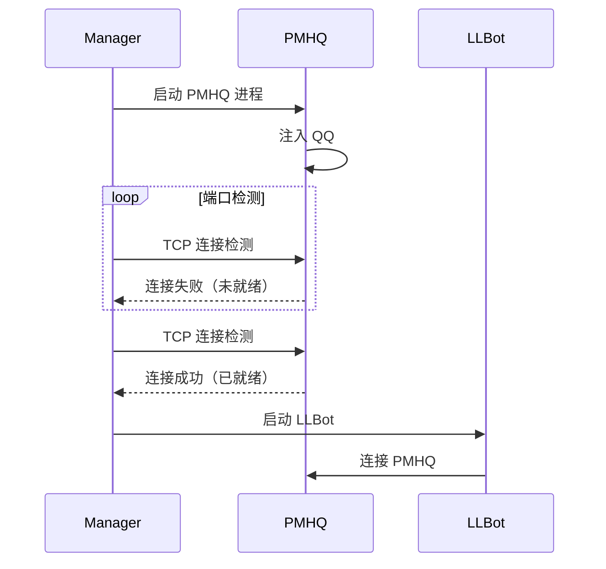

# PMHQ 管理 API

本页面详细介绍 LLBot Manager 的 PMHQ 进程管理接口。PMHQ 是连接 QQ 和 LLBot 的桥梁，Manager 在 native 模式下完全接管 PMHQ 进程的生命周期。

## PMHQ 管理概述

PMHQ 是注入 QQ 客户端的核心组件，负责提供 OneBot 协议接口。根据实例的 `pmhq_mode` 配置，Manager 对 PMHQ 的管理方式有所不同：

| 模式 | 说明 | Manager 职责 |
| --- | --- | --- |
| `native` | Manager 完全管理 PMHQ 进程 | 下载、启动、停止、端口检测、日志收集 |
| `external` | PMHQ 由外部进程管理 | Manager 仅连接，不负责启停 |

在 `native` 模式（默认）下，Manager 拥有 PMHQ 进程的完整控制权，可以通过以下 API 对 PMHQ 进行精细管理。

<callout type="info" title="与实例启动的关系">
`POST /api/accounts/{id}/start` 已经包含了 PMHQ 的启动流程。只有在需要单独操作 PMHQ（如仅重启 PMHQ 而不重启 LLBot）时，才需要使用本页面的 PMHQ 专用接口。
</callout>

## 启动 PMHQ

### `POST /api/accounts/{id}/pmhq/start`

单独启动指定实例的 PMHQ 进程。此接口仅启动 PMHQ 并注入 QQ，不会启动 LLBot 进程。

```bash
curl -X POST http://127.0.0.1:9090/api/accounts/550e8400-e29b-41d4-a716-446655440000/pmhq/start
```

```powershell
$instanceId = "550e8400-e29b-41d4-a716-446655440000"
Invoke-RestMethod -Uri "http://127.0.0.1:9090/api/accounts/$instanceId/pmhq/start" `
    -Method Post
```

#### 响应示例

```json
{
  "id": "550e8400-e29b-41d4-a716-446655440000",
  "pmhq_status": "starting",
  "message": "PMHQ 启动中，正在注入 QQ..."
}
```

启动后，Manager 会持续检测 PMHQ 端口是否就绪。端口就绪后，PMHQ 状态会变为 `running`。

## 停止 PMHQ

### `POST /api/accounts/{id}/pmhq/stop`

停止指定实例的 PMHQ 进程。停止操作会以进程树方式终止 PMHQ 及其相关子进程，确保残留进程被完整清理。

<callout type="warning" title="停止 PMHQ 会影响 LLBot">
停止 PMHQ 后，依赖 PMHQ 的 LLBot 进程将无法正常工作。如果 LLBot 正在运行，建议先停止 LLBot 或直接使用 `POST /api/accounts/{id}/stop` 停止整个实例。
</callout>

```bash
curl -X POST http://127.0.0.1:9090/api/accounts/550e8400-e29b-41d4-a716-446655440000/pmhq/stop
```

```powershell
$instanceId = "550e8400-e29b-41d4-a716-446655440000"
Invoke-RestMethod -Uri "http://127.0.0.1:9090/api/accounts/$instanceId/pmhq/stop" `
    -Method Post
```

#### 响应示例

```json
{
  "id": "550e8400-e29b-41d4-a716-446655440000",
  "pmhq_status": "stopped",
  "message": "PMHQ 已停止"
}
```

## 获取 PMHQ 日志

### `GET /api/accounts/{id}/pmhq/logs`

获取指定实例 PMHQ 进程的运行日志。支持通过 `tail` 参数控制返回的日志行数。

#### 查询参数

| 参数 | 类型 | 默认值 | 说明 |
| --- | --- | --- | --- |
| `tail` | integer | `100` | 返回最后 N 行日志 |

```bash
# 获取最后 100 行日志
curl http://127.0.0.1:9090/api/accounts/550e8400-e29b-41d4-a716-446655440000/pmhq/logs

# 获取最后 200 行日志
curl "http://127.0.0.1:9090/api/accounts/550e8400-e29b-41d4-a716-446655440000/pmhq/logs?tail=200"
```

```powershell
$instanceId = "550e8400-e29b-41d4-a716-446655440000"

# 获取最后 100 行日志
Invoke-RestMethod -Uri "http://127.0.0.1:9090/api/accounts/$instanceId/pmhq/logs"

# 获取最后 200 行日志
Invoke-RestMethod -Uri "http://127.0.0.1:9090/api/accounts/$instanceId/pmhq/logs?tail=200"
```

#### 响应示例

```json
{
  "id": "550e8400-e29b-41d4-a716-446655440000",
  "tail": 100,
  "logs": [
    "[2026-07-10 08:00:01] PMHQ 启动中...",
    "[2026-07-10 08:00:02] 正在注入 QQ 进程...",
    "[2026-07-10 08:00:05] QQ 注入成功",
    "[2026-07-10 08:00:06] OneBot 服务监听于 127.0.0.1:13000",
    "[2026-07-10 08:00:07] 等待 LLBot 连接...",
    "[2026-07-10 08:00:10] LLBot 已连接",
    "[2026-07-10 08:00:10] 等待 QQ 登录..."
  ]
}
```

<callout type="tip" title="排查问题">
当实例启动失败或运行异常时，PMHQ 日志是排查问题的首要工具。通过查看日志可以快速定位 PMHQ 注入失败、端口冲突或 QQ 版本不兼容等问题。
</callout>

## native 模式 vs external 模式

| 对比项 | native 模式 | external 模式 |
| --- | --- | --- |
| PMHQ 进程管理 | Manager 完全管理 | 外部进程管理 |
| PMHQ 下载 | Manager 自动下载 | 需手动准备 |
| PMHQ 启停接口 | 可用 | 不可用（返回错误） |
| 端口就绪检测 | Manager 自动检测 | 需确保 PMHQ 已就绪 |
| 日志收集 | Manager 自动收集 | 不可用 |
| 适用场景 | 标准使用场景 | 自定义 PMHQ 部署 |

## PMHQ 自动下载流程

在 `native` 模式下，当实例首次启动且本地不存在 PMHQ 可执行文件时，Manager 会自动执行以下下载流程：



1. **检测本地文件**：检查 `bin/pmhq/` 目录下是否已存在 PMHQ 可执行文件。
2. **获取版本信息**：从 GitHub Releases API 获取 PMHQ 最新版本信息。
3. **下载二进制文件**：根据当前操作系统下载对应的 PMHQ 可执行文件。
4. **保存到本地**：将下载的文件保存到 `bin/pmhq/` 目录。
5. **启动 PMHQ**：使用下载的文件启动 PMHQ 进程。

<callout type="warning" title="下载失败处理">
如果因网络问题导致 PMHQ 下载失败，可以手动下载 PMHQ 可执行文件并放置到 `bin/pmhq/` 目录，然后重新启动实例。详见 [FAQ](./faq) 中的相关说明。
</callout>

## PMHQ 端口就绪检测机制

PMHQ 启动后，Manager 不会立即启动 LLBot，而是持续检测 PMHQ 的通信端口是否就绪：

1. **启动 PMHQ 后开始检测**：PMHQ 进程启动后，Manager 开始轮询检测端口。
2. **TCP 连接检测**：尝试与 PMHQ 端口建立 TCP 连接，连接成功则认为端口已就绪。
3. **超时处理**：如果在超时时间内端口始终未就绪，Manager 会标记实例状态为 `error` 并记录错误信息。
4. **就绪后启动 LLBot**：端口就绪后，Manager 立即启动 LLBot 进程连接到 PMHQ。



## 下一步

- [架构设计](./architecture) — 了解 Manager 的整体架构和端口分配策略
- [配置说明](./config) — 了解 PMHQ 配置文件的详细说明
