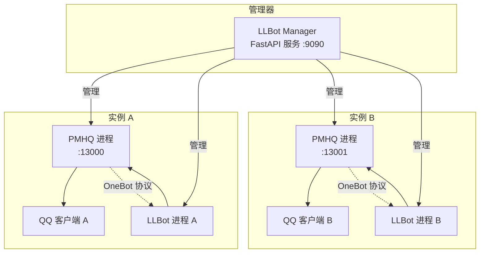
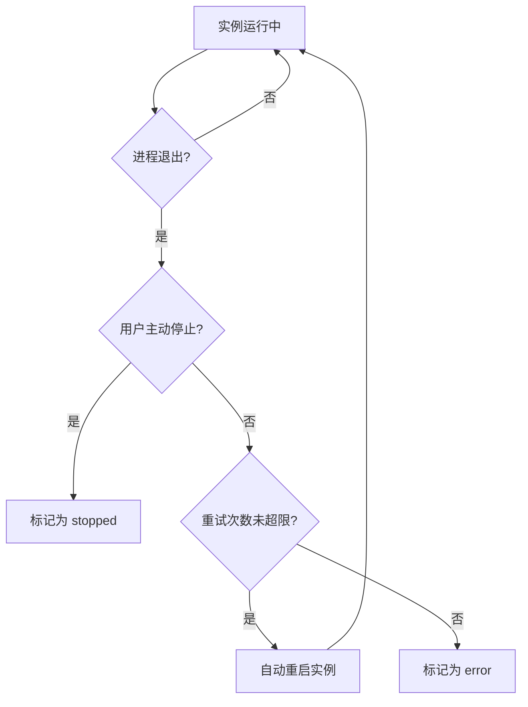

# 架构设计

本页面详细介绍 LLBot Manager 的整体架构设计，包括组件关系、端口分配策略、实例隔离机制、状态持久化、PMHQ 进程管理、Cython 代码保护和自动重启机制。

## 整体架构

LLBot Manager 由以下核心组件构成：

- **Manager（FastAPI 服务）**：管理器的核心进程，提供 HTTP API，负责实例的全生命周期管理。
- **PMHQ 进程**：每个实例对应一个 PMHQ 进程，负责注入 QQ 客户端并提供 OneBot 协议接口。
- **LLBot 进程**：每个实例对应一个 LLBot 进程，连接 PMHQ 提供的 OneBot 接口，处理消息逻辑。
- **QQ 客户端**：被 PMHQ 注入的目标进程。



Manager 作为中央控制器，管理多个实例的 PMHQ 和 LLBot 进程。每个实例相互独立，拥有自己的端口、工作目录和配置文件。

## 端口分配策略

为避免多实例间的端口冲突，Manager 采用自动端口分配策略。创建实例时，如果没有手动指定端口，Manager 会为每个实例分配以下四类端口：

| 端口类型 | 起始端口 | 用途 | 说明 |
| --- | --- | --- | --- |
| PMHQ 端口 | 13000 | PMHQ 通信端口 | LLBot 通过此端口连接 PMHQ |
| WebUI 端口 | 3080 | LLBot WebUI | LLBot 的 Web 管理界面 |
| Satori 端口 | 5600 | Satori 协议 | LLBot 的 Satori 协议监听端口 |
| Milky 端口 | 3010 | Milky 协议 | LLBot 的 Milky 协议监听端口 |

### 分配规则

- 每个端口类型从起始端口开始递增分配。
- 分配前会检测端口是否被占用，已占用的端口会自动跳过。
- 同一实例的四个端口会被记录在实例配置中，后续启动时复用。

例如，创建三个实例后的端口分配情况：

| 实例 | PMHQ 端口 | WebUI 端口 | Satori 端口 | Milky 端口 |
| --- | --- | --- | --- | --- |
| 实例 A | 13000 | 3080 | 5600 | 3010 |
| 实例 B | 13001 | 3081 | 5601 | 3011 |
| 实例 C | 13002 | 3082 | 5602 | 3012 |

## 实例隔离

每个实例拥有完全独立的工作目录，确保实例之间互不干扰。实例工作目录结构如下：

```
llbot_manager_workspace/
└── instances/
    └── {instance_id}/          # 实例工作目录
        ├── llbot/              # LLBot 运行目录
        │   ├── config/         # LLBot 配置文件
        │   ├── data/           # LLBot 数据文件
        │   └── logs/           # LLBot 日志
        ├── pmhq_config.json   # PMHQ 配置文件
        ├── pmhq_logs.txt       # PMHQ 日志文件
        └── ...
```

每个实例的 LLBot 配置、PMHQ 配置、日志和数据都存储在各自的目录下，删除实例时会一并清理。

## 状态持久化

Manager 使用 `state.json` 文件持久化所有实例的配置信息，位于工作目录根目录：

```
llbot_manager_workspace/
├── state.json                  # 所有实例配置的持久化文件
└── instances/
    └── ...
```

`state.json` 记录了所有实例的完整配置，包括实例 ID、名称、端口、QQ 路径等。Manager 重启后会从 `state.json` 恢复所有实例配置，但不会自动启动实例（实例状态恢复为 `stopped`）。

## PMHQ 进程管理

在 `native` 模式下，Manager 完全管理 PMHQ 进程的生命周期：

### 启动命令

Manager 根据实例配置构建 PMHQ 启动命令，包括 QQ 路径、端口、额外参数等：

```
pmhq.exe --qq-path "C:/Program Files/Tencent/QQ/QQ.exe" \
         --port 13000 \
         --extra-args "..."
```

### 端口检测

PMHQ 启动后，Manager 会通过 TCP 连接检测端口是否就绪：

- **轮询间隔**：每秒检测一次。
- **超时时间**：默认超时时间后，如果端口仍未就绪，则标记实例为 `error` 状态。
- **就绪条件**：TCP 连接成功即认为端口已就绪。

### 日志收集

PMHQ 运行期间的输出会被收集并保存到实例工作目录的 `pmhq_logs.txt` 文件中。通过 `GET /api/accounts/{id}/pmhq/logs` 接口可以读取最近的日志。

### 进程树终止

停止 PMHQ 时，Manager 会以进程树方式终止 PMHQ 及其所有子进程，确保没有残留进程。这包括 PMHQ 注入 QQ 后产生的相关进程。

## Cython 编译保护

LLBot Manager 的核心代码通过 Cython 编译进行保护，防止源码被直接反编译。编译流程如下：


### 编译流程说明

| 步骤 | 输入 | 输出 | 说明 |
| --- | --- | --- | --- |
| 1 | `.py` | `.pyx` | 将 Python 源文件标记为 Cython 源文件 |
| 2 | `.pyx` | `.c` | Cython 编译器将 Python 代码转换为 C 代码 |
| 3 | `.c` | `.pyd` (Windows) / `.so` (Linux) | 编译器将 C 代码编译为二进制扩展模块 |
| 4 | `.pyd` / `.so` | 可执行文件 | PyInstaller 将二进制模块打包为独立可执行文件 |

<callout type="info" title="代码保护效果">
经过 Cython 编译后，核心逻辑以二进制 `.pyd` / `.so` 文件存在，无法通过常规工具直接反编译为可读的 Python 源码，有效保护了知识产权。
</callout>

## 自动重启机制

Manager 会监控运行中实例的进程状态。当检测到实例异常退出时，会根据配置决定是否自动重启：

1. **进程监控**：Manager 定期检查运行中实例的 PMHQ 和 LLBot 进程状态。
2. **退出检测**：当发现进程异常退出（非用户主动停止）时，触发自动重启流程。
3. **自动重启**：按照实例启动的标准流程重新启动 PMHQ 和 LLBot 进程。
4. **重试限制**：如果短时间内频繁崩溃，会停止自动重试并标记实例为 `error` 状态，避免无限重启循环。



## 下一步

- [配置说明](./config) — 了解实例配置、LLBot 配置和 PMHQ 配置的详细说明
- [FAQ](./faq) — 常见问题与解答
