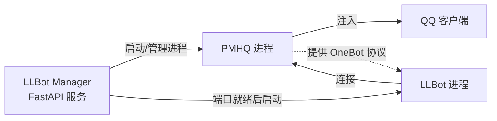

# 什么是 LLBot Manager

**LLBot Manager** 是一个基于 Python + FastAPI 构建的 **LLBot 多实例管理器**。它能够在一台机器上同时管理多个 LLBot（LuckyLilliaBot）机器人实例，每个实例拥有独立的 PMHQ 进程、端口和配置文件，并通过统一的 RESTful HTTP API 进行生命周期管理。

## 核心功能

LLBot Manager 提供了以下核心能力：

- **多实例管理**：通过统一的 HTTP API 创建、启动、停止、重启和删除多个 LLBot 实例，每个实例相互隔离、互不干扰。
- **PMHQ 原生进程管理**：在 native 模式下，Manager 完全接管 PMHQ 进程的生命周期，包括启动、端口就绪检测、日志收集和进程树终止。
- **自动下载 PMHQ**：首次使用时，Manager 会自动从 GitHub Releases 下载对应平台的 PMHQ 可执行文件，无需手动配置。
- **端口自动分配**：创建实例时自动分配 PMHQ 端口、WebUI 端口、Satori 端口和 Milky 端口，避免端口冲突。
- **Cython 代码保护**：核心代码通过 Cython 编译为 `.pyd` / `.so` 文件，再由 PyInstaller 打包，有效保护源代码不被反编译。

## 工作原理

LLBot Manager 的工作流程可以概括为以下步骤：

1. **Manager 管理 PMHQ 进程**：当用户启动一个实例时，Manager 首先启动对应的 PMHQ 进程，PMHQ 负责注入 QQ 客户端。
2. **PMHQ 注入 QQ**：PMHQ 以注入方式附加到 QQ 进程，建立与 QQ 的通信通道。
3. **PMHQ 启动后 Manager 启动 LLBot**：Manager 持续检测 PMHQ 端口是否就绪，一旦端口可用，便启动 LLBot 进程连接到 PMHQ，完成整个机器人实例的启动。

## 与 LLBot 的关系

[**LLBot（LuckyLilliaBot）**](https://github.com/LLOneBot/LuckyLilliaBot) 是一个基于 OneBot 标准的 QQ 协议端框架，负责处理消息收发、事件推送和协议转换。它通过连接 PMHQ 获取 QQ 的底层能力。

**LLBot Manager** 则是多实例管理工具，它不直接处理消息逻辑，而是负责：

- 管理 PMHQ 进程的下载、启动和停止
- 管理 LLBot 进程的启动和停止
- 分配和协调端口资源
- 持久化实例配置
- 提供 RESTful API 供外部调用

简而言之，**LLBot 是协议端框架，Manager 是多实例管理工具**。Manager 在 Core 目录中通过 git submodule 引用 LLBot 源码。

## 适用场景

LLBot Manager 适用于以下场景：

- **多机器人运维**：需要在一台服务器上同时运行多个 QQ 机器人实例（例如不同账号服务不同群组）。
- **自动化部署**：通过 HTTP API 实现实例的自动化创建和销毁，适合 CI/CD 流程或动态扩缩容。
- **开发与测试**：开发者在本地快速创建多个测试实例，验证不同配置下的行为。
- **托管服务**：为多个用户提供独立的机器人实例，每个实例拥有独立的 QQ 账号和配置。

## 下一步

- [安装指南](./install) — 了解如何安装和启动 LLBot Manager
- [快速开始](./quickstart) — 用几分钟创建并启动你的第一个实例
- [API 概览](./api_overview) — 查看所有可用的 HTTP API 端点
