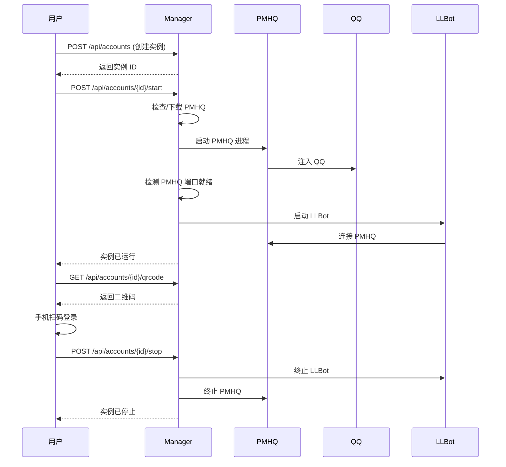

# 快速开始

本指南将带你从零开始，完成 LLBot Manager 的启动、实例创建、启动、扫码登录到停止的完整流程。

## 1. 启动 Manager

确保已按照 [安装指南](./install) 完成 LLBot Manager 的安装。在终端中运行以下命令启动管理器：

```bash
# Windows
.\llbot_manager.exe --port 9090

# Linux / macOS
./llbot_manager --port 9090
```

启动后，Manager 会在 `http://127.0.0.1:9090` 提供 HTTP API 服务。

你可以通过以下命令验证 Manager 是否正常运行：

```bash
curl http://127.0.0.1:9090/api/status
```

```powershell
# PowerShell
Invoke-RestMethod -Uri "http://127.0.0.1:9090/api/status"
```

预期返回类似如下 JSON：

```json
{
  "status": "running",
  "version": "1.0.0",
  "uptime": 12,
  "instances": 0
}
```

## 2. 创建第一个实例

通过 `POST /api/accounts` 创建一个新实例。以下是创建请求示例：

```bash
curl -X POST http://127.0.0.1:9090/api/accounts \
  -H "Content-Type: application/json" \
  -d '{
    "name": "my-first-bot",
    "pmhq_mode": "native"
  }'
```

```powershell
# PowerShell
$body = @{
    name = "my-first-bot"
    pmhq_mode = "native"
} | ConvertTo-Json

Invoke-RestMethod -Uri "http://127.0.0.1:9090/api/accounts" `
    -Method Post `
    -ContentType "application/json" `
    -Body $body
```

预期返回：

```json
{
  "id": "550e8400-e29b-41d4-a716-446655440000",
  "name": "my-first-bot",
  "pmhq_mode": "native",
  "pmhq_port": 13000,
  "webui_port": 3080,
  "satori_port": 5600,
  "milky_port": 3010,
  "status": "stopped",
  "created_at": "2026-07-10T08:00:00Z"
}
```

<callout type="info" title="记录实例 ID">
请记下返回的 `id` 字段，后续操作都需要使用该 ID。上例中的 ID 仅为示例，实际创建时会生成一个 UUID。
</callout>

## 3. 启动实例

使用实例 ID 启动实例。启动过程会自动执行以下步骤：

1. **下载 PMHQ**（如果尚未下载）：从 GitHub Releases 下载 PMHQ 可执行文件。
2. **启动 PMHQ 进程**：以 native 模式启动 PMHQ，PMHQ 注入 QQ 客户端。
3. **等待端口就绪**：持续检测 PMHQ 端口是否可连接。
4. **启动 LLBot**：端口就绪后，启动 LLBot 进程连接到 PMHQ。

```bash
curl -X POST http://127.0.0.1:9090/api/accounts/550e8400-e29b-41d4-a716-446655440000/start
```

```powershell
# PowerShell
$instanceId = "550e8400-e29b-41d4-a716-446655440000"

Invoke-RestMethod -Uri "http://127.0.0.1:9090/api/accounts/$instanceId/start" `
    -Method Post
```

返回示例：

```json
{
  "id": "550e8400-e29b-41d4-a716-446655440000",
  "status": "starting",
  "message": "实例启动中，PMHQ 正在准备..."
}
```

<callout type="warning" title="首次启动较慢">
首次启动实例时，需要下载 PMHQ，耗时取决于网络速度。后续启动会直接使用已下载的 PMHQ，速度会快很多。
</callout>

## 4. 查看状态

启动后，可以查询实例的运行状态：

```bash
curl http://127.0.0.1:9090/api/accounts/550e8400-e29b-41d4-a716-446655440000/status
```

```powershell
# PowerShell
$instanceId = "550e8400-e29b-41d4-a716-446655440000"

Invoke-RestMethod -Uri "http://127.0.0.1:9090/api/accounts/$instanceId/status"
```

返回示例：

```json
{
  "id": "550e8400-e29b-41d4-a716-446655440000",
  "status": "running",
  "pmhq_status": "running",
  "llbot_status": "running",
  "pmhq_port": 13000,
  "qq_logged_in": false,
  "uptime": 45
}
```

状态字段的含义：

| 字段 | 说明 |
| --- | --- |
| `status` | 实例整体状态：`stopped` / `starting` / `running` / `error` |
| `pmhq_status` | PMHQ 进程状态：`stopped` / `running` / `error` |
| `llbot_status` | LLBot 进程状态：`stopped` / `running` / `error` |
| `qq_logged_in` | QQ 是否已登录 |

## 5. 获取二维码

实例启动后，QQ 尚未登录。通过以下接口获取登录二维码：

```bash
curl http://127.0.0.1:9090/api/accounts/550e8400-e29b-41d4-a716-446655440000/qrcode
```

```powershell
# PowerShell
$instanceId = "550e8400-e29b-41d4-a716-446655440000"

$response = Invoke-RestMethod -Uri "http://127.0.0.1:9090/api/accounts/$instanceId/qrcode"

# 保存二维码图片到本地
$bytes = [Convert]::FromBase64String($response.qrcode_base64)
[IO.File]::WriteAllBytes("qrcode.png", $bytes)
Write-Host "二维码已保存为 qrcode.png，请用手机 QQ 扫码登录"
```

返回示例：

```json
{
  "id": "550e8400-e29b-41d4-a716-446655440000",
  "has_qrcode": true,
  "qrcode_base64": "iVBORw0KGgoAAAANSUhEUgAA..."
}
```

用手机 QQ 扫描二维码完成登录。登录成功后，再次查询状态时 `qq_logged_in` 会变为 `true`。

## 6. 停止实例

当你不再需要该实例时，可以停止它：

```bash
curl -X POST http://127.0.0.1:9090/api/accounts/550e8400-e29b-41d4-a716-446655440000/stop
```

```powershell
# PowerShell
$instanceId = "550e8400-e29b-41d4-a716-446655440000"

Invoke-RestMethod -Uri "http://127.0.0.1:9090/api/accounts/$instanceId/stop" `
    -Method Post
```

返回示例：

```json
{
  "id": "550e8400-e29b-41d4-a716-446655440000",
  "status": "stopped",
  "message": "实例已停止"
}
```

停止操作会依次终止 LLBot 进程和 PMHQ 进程，确保进程树被完整清理。

## 完整流程回顾



## 下一步

- [API 概览](./api_overview) — 查看所有可用端点
- [实例管理 API](./api_instances) — 深入了解实例管理接口
- [PMHQ 管理 API](./api_pmhq) — 了解 PMHQ 进程管理接口
